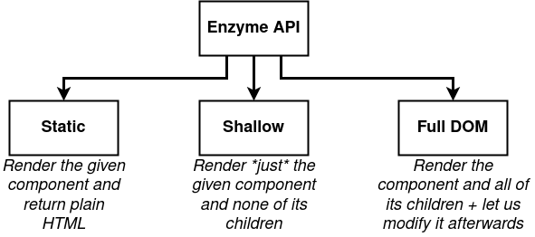

# Testing Input Comments Form - React Redux App

 

----------

 

----------

 

----------

 

----------

 

----------

 

----------

 

----------

 

----------

 

----------

 


----------


 

----------

 

----------

 

----------


## [Enzyme](https://www.npmjs.com/package/enzyme)

###### Enzyme is a JavaScript Testing utility for React that makes it easier to test your React Components' output. You can also manipulate, traverse, and in some ways simulate runtime given the output.

```
npm i --save-dev enzyme enzyme-adapter-react-16
```

setupTests.js

```
import Enzyme from "enzyme";
import Adapter from "enzyme-adapter-react-16";

Enzyme.configure({adapter: new Adapter()})
```


[Shallow Rendering API](https://enzymejs.github.io/enzyme/docs/api/shallow.html#shallow-rendering-api)


----------

## Absolute Imports:

**webpack** is using  ``` src ``` folder as the first lookup location instead of ``` node_modules ``` (default)

Now when you need to move this file, your import statements won’t break! 

An added bonus is that it looks much cleaner, and helps people that are new to your codebase have a clearer understanding of how your project is organized.

adding a ```jsconfig.json``` file to the root of your project (where ```package.json``` is) and instruct **webpack** to use ```src``` as the lookup reference


[.env](https://www.digitalocean.com/community/tutorials/react-clean-import-statements-in-react)
```
NODE_PATH=src/
```

[jsconfig.json](https://www.digitalocean.com/community/tutorials/react-clean-import-statements-in-react)

``` 
{
  "compilerOptions": {
    "baseUrl": "src"
  }
}
```

Your project will now use absolute imports in development, and production builds.


### Testing


----------

 


Redux error for CommentBox component:

``` 
  Could not find "store" in the context of "Connect(CommentBox)". Either wrap the root component in a <Provider>, or pass a custom React context provider to <Provider> and the corresponding React context consumer to Connect(CommentBox) in connect options.
```

Issue1:

before CommentBox.test.js:
``` 
import CommentBox from "components/CommentBox";
beforeEach(() => wrapped = mount(<CommentBox/>))
```


after CommentBox.test.js:
``` 
import CommentBox from "components/CommentBox";
import {createStore} from "redux;
import {Provider} from "react-redux";
import reducers from "reducers";
 
beforeEach(() => wrapped = mount(<Provider store={createStore(reducers, {})}>  <CommentBox/> </Provider>)
```


Issue2:

before CommentBox.test.js:
``` 
import CommentBox from "components/CommentBox";
beforeEach(() => wrapped = mount(<CommentBox/>))
```


after CommentBox.test.js:
``` 
import Root from "Root";
beforeEach(() => wrapped = mount(<Root><CommentBox/></Root>))
```


Issue2 (wrap CommentBox):

before src/index.js
``` 
const composeEnhancers = window.__REDUX_DEVTOOLS_EXTENSION_COMPOSE__ || compose;
const store = createStore(reducers,
    composeEnhancers(applyMiddleware()));

ReactDOM.render(
    <Provider store={store}>
        <App/>
    </Provider>,
    document.querySelector('#root')
)

```

after src/index.js
``` 
import Root from "Root";

ReactDOM.render(
    <Root>
        <App/>
    </Root>,
    document.querySelector('#root')
)

```

after src/Root.js

``` 
import React from "react";
import {Provider} from "react-redux";

import {createStore, applyMiddleware, compose} from "redux";
import reducers from "reducers";

export default (props) => {
    const composeEnhancers = window.__REDUX_DEVTOOLS_EXTENSION_COMPOSE__ || compose;
    const store = createStore(reducers,
        composeEnhancers(applyMiddleware()));
    return (
        <Provider store={store}>
            {props.children}
        </Provider>
    )
}
```